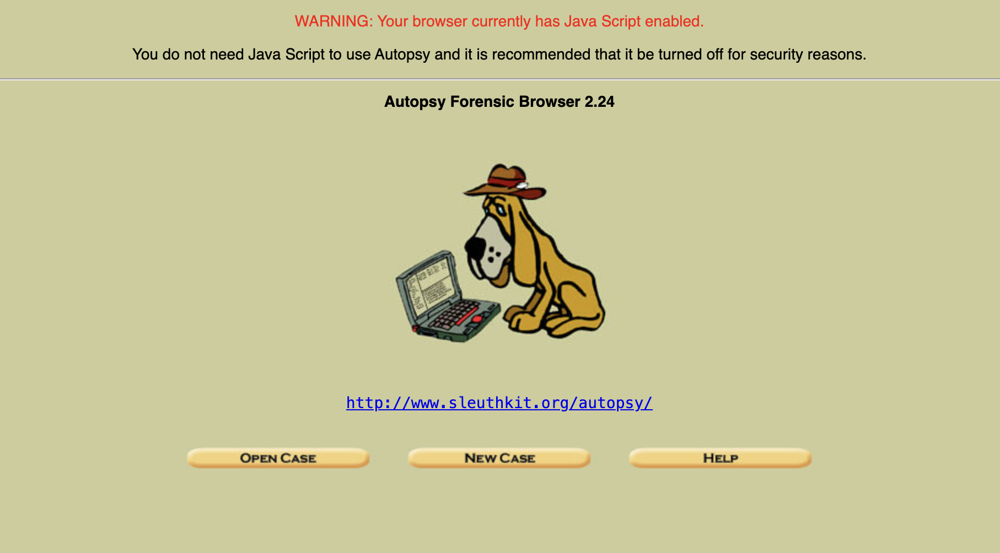
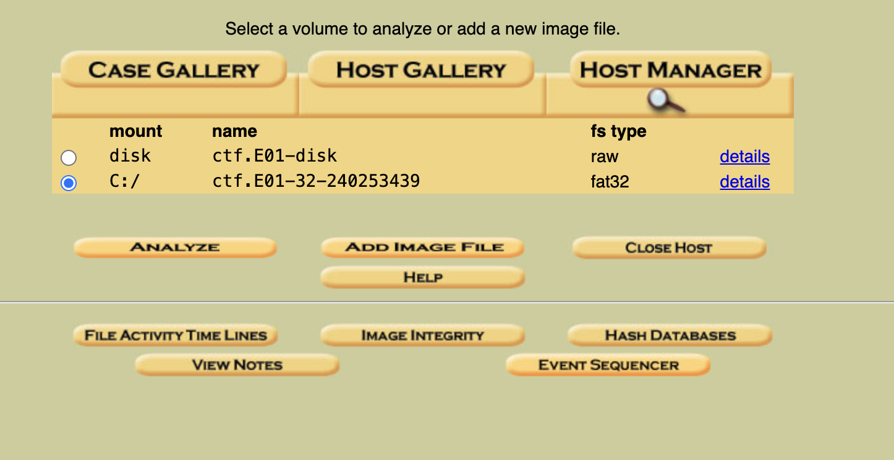
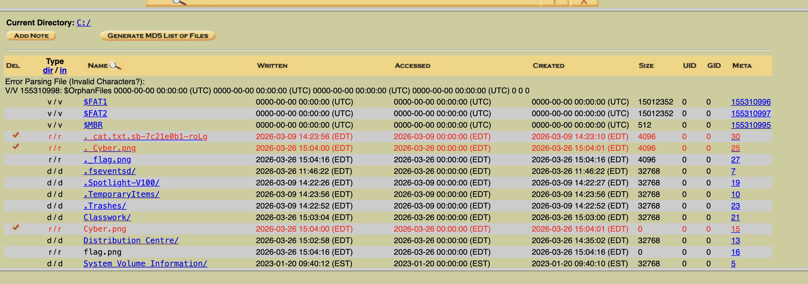
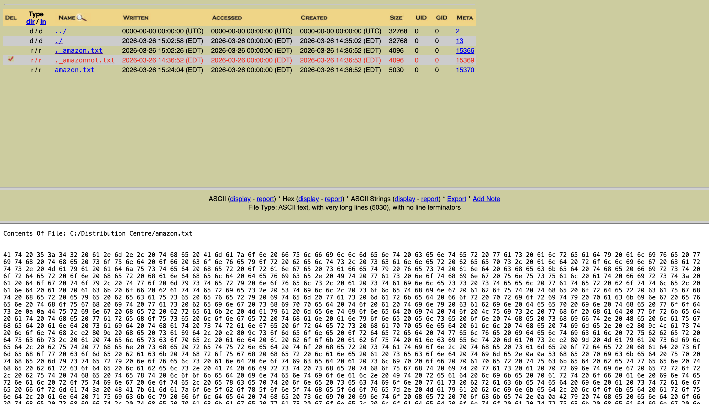
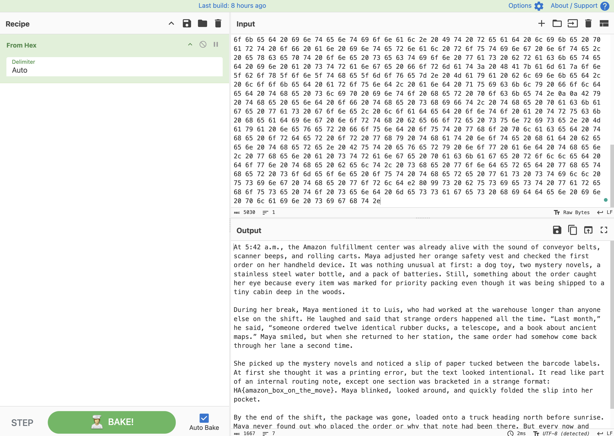

# Answer Key to Solve CTF

## How to look for packet in wireshark

### For a small little challenge still, run the following command and search for the packet.
```
tcp && tcp.port != 443 && tcp.port != 80
```
### To find the exact packet, run the following command.
```
ip.src == 10.152.25.28
```

## How to find Flag using Autopsy

### Ensure autopsy is installed and run the command
```
autopsy
```
### Go to the localhost port generated and the GUI will come up.

### Then create a case with the host and use the special ctf.E* to locate encase files
### Once finished, you will be able to select the C:/ mount

### Go to Distribution Centre

### Press the amazon.txt and hex values will appear. Decode them to find the flag.



